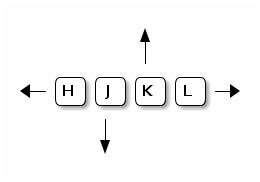

# Modes

| Key   | Mode                                      |
|-------|-------------------------------------------|
| `i`   | Insert at current cursor position         |
| `I`   | Insert at beginning of line               |
| `a`   | Insert after current cursor position      |
| `A`   | Insert at end of line                     |
| `o`   | Insert at new line after cursor position  |
| `O`   | Insert at new line before cursor position |
| `r`   | Replace char at current cursor position   |
| `R`   | Replace (overwrite) mode                  |
| `ESC` | Normal                                    |

# Vim as a Language

```
[count]operation[modifier|count]{motion}
```

## Operation (Verbs)

| Command | Meaning                        |
|---------|--------------------------------|
| `d`     | delete                         |
| `c`     | change                         |
| `y`     | yank (copy)                    |
| `v`     | visually select (`V` for line) |


## Modifiers

| Modifier | Meaning                 |
|----------|-------------------------|
| `i`      | inside                  |
| `a`      | around                  |
| *number* | e.g.: `1`, `2`, `10`    |
| `t`      | search (stop before it) |
| `f`      | search (stop on it)     |
| `/`      | find regex              |


## Motion (Nouns)

| Noun        | Meaning             |
|-------------|---------------------|
| `w`         | word                |
| `s` or  `)` | sentence            |
| `p` or `}`  | paragraph           |
| `t`         | tag (HTML/XML)      |
| `b`         | block (programming) |

These key can also be used for navigation.

# Navigation

## By Line or Character

| Key        | Movement          |
|------------|-------------------|
| `h`        | left              |
| `j`        | down              |
| `k`        | up                |
| `l`        | right             |
| `^` or `0` | beginning of line |
| `$`        | end of line       |



> Hint: `j` looks like an arrow pointing down

## By Word

| Keys | Movement                                 |
|------|------------------------------------------|
| `w`  | next word                                |
| `W`  | next word, don't stop at punctuation     |
| `b`  | previous word                            |
| `B`  | previous word, don't stop at punctuation |

## By Page

| Keys      | Movement  |
|-----------|-----------|
| `ctl`-`b` | page up   |
| `ctl`-`f` | page down |

## Begin and End of Document

| Keys         | Movement   |
|--------------|------------|
| `gg` or `:1` | first line |
| `G`  or `:$` | last line  |

## Go to Line

| Keys                                        | Movement   |
|---------------------------------------------|------------|
| `<line-no>gg`, `<line-no>G` or `:<line-no>` | go to line |


# Editing

## Cut / Delete

| Key         | Action                            |
|-------------|-----------------------------------|
| `x` or `dl` | Delete (cut) char at cursor       |
| `X` or `dh` | Delete (cut) char before cursor   |
| `dw`        | Delete (cut) word at cursor       |
| `db`        | Delete (cut) word before cursor   |
| `dd`        | Delete (cut) current line         |
| `D` or `d$` | Delete (cut) to end of line       |
| `d0`        | Delete (cut) to beginning of line |

## Copy / Yank

| Key  | Action                          |
|------|---------------------------------|
| `yw` | Yank (copy) word at cursor      |
| `yb` | Yank (copy)  word before cursor |
| `yy` | Copy line                       |

## Paste / Put

| Key | Action              |
|-----|---------------------|
| `p` | Paste after cursor  |
| `P` | Paste before cursor |


## Change Text

| Key         | Action                        |
|-------------|-------------------------------|
| `c<motion>` | Change text                   |
| `C`         | Change text until end of line |
| `cc`        | Change entire line            |


## Join Lines

| Key  | Action                               |
|------|--------------------------------------|
| `J`  | Join lines with spaces added         |
| `gJ` | Join lines without additional spaces |


## Change Case

| Key          | Action                             |
|--------------|------------------------------------|
| `gU<motion>` | To upper case                      |
| `gu<motion>` | To lower case                      |
| `g~<motion>` | Toggle case                        |
| `~`          | Toggle case of character at cursor |


## Registers

- Unnamed (default): `""`
  - holds text from last `d`, `c`, `s`, `x` and `y` 
- Numbered: `"0` - `"9`
  - `"0` holds last yanked (`y`) text
  - `"1` holds last cut (`d`) or changed (`c`) text
  - `"1` shifts with each `d` and `c`
- Named: `"a` - `"z`
  - ...
  - User upper-case (`"A` - `"Z` to append to the content of the register)
- Black-hole: `"_`
  - doesn't store removed text in a register

```
[count][register]operation
```

or

```
[register][count]operation
```


| Key                  | Action                                                             |
|----------------------|--------------------------------------------------------------------|
| `:reg [register(s)]` | Show content of listed registers. Show all if no register provided |

# Search and Replace

## Search on Line

| Key       | Action                                    |
|-----------|-------------------------------------------|
| `f<char>` | Search forward on line                    |
| `F<char>` | Search backwards on line                  |
| `t<char>` | Go forward to <char> stopping before char |
| `T<char>` | Go backward to <char> stopping after char |
| `;`       | Continue search in original direction     |
| `,`       | Continue search in opposite direction     |

> These commands are considered as motions and can be used
> with operations like `d`, `c` and `y`.

## Search in Document

| Key       | Action                                        |
|-----------|-----------------------------------------------|
| `/<word>` | Search forwards for word                      |
| `?<word>` | Search backward for word                      |
| `*`       | Search forward for word under cursor          |
| `#`       | Search backward for word under cursor         |
| `n`       | Go to next occurrence in search direction     |
| `N`       | Go to previous occurrence in search direction |


## Replace

General command syntax:

```
:[range]/<old>/<new>/[flags]
```

> The separator `/` can be replaced by another symbol (e.g. `#` or `|`)

Range:
- `<number>`: line with number
- `<number-1>,<number-2>`: from line `number-1` to `number-2`
- `/<pattern-1>/,/<pattern-2>/`: from match of `pattern-1` to `pattern-2`
- `.`: current line
- `$`: last line
- `%` or `1,$`: entire file

> Range variants can be combined

Flags:
- `g`: global (all occurrences in line)
- `c`: confirm each replacement
- `i`: ignore case

# Text Objects

- Word: `w` (or `W` with punctuation)
- Sentence: `s`
- Paragraph: `p`
- Block: `b`
- Tag: `t`
- Various delimiters: `{`, `]`, `)`, `<`, `"`,...

## Include or exclude delimiter

- Apply operator to object including separators: `<operator>a<object>`
- Apply operator to object without separators: `<operator>i<object>`

Examples:

- `daw`: Delete A Word
- `ciw`: Change Inner Word (without delimiter)


# Various

| Key                   | Action                                 |
|-----------------------|----------------------------------------|
| `.`                   | Repeat previous command                |
| `zz`                  | Shift current line to middle of screen |
| `<tab>` or `<ctrl>-d` | Autocompletion for commands            |
| `u`                   | Undo last command                      |
| `<ctrl>-r`            | Redo last command                      |


# Help and Documentation

| Command               | Action                                   |
|-----------------------|------------------------------------------|
| `:h [command]`        | Get help (without command: general help) |
| `:h {subject}`        | Get help for a subject                   |
| `<ctrl>-]`            | Follow link                              |
| `<ctrl>-w <ctrl>-w`   | Switch between help and editor window    |

# See Also

[Learn Vim Progressively](http://yannesposito.com/Scratch/en/blog/Learn-Vim-Progressively/)
[Learn Vim For the Last Time](https://danielmiessler.com/study/vim/)
